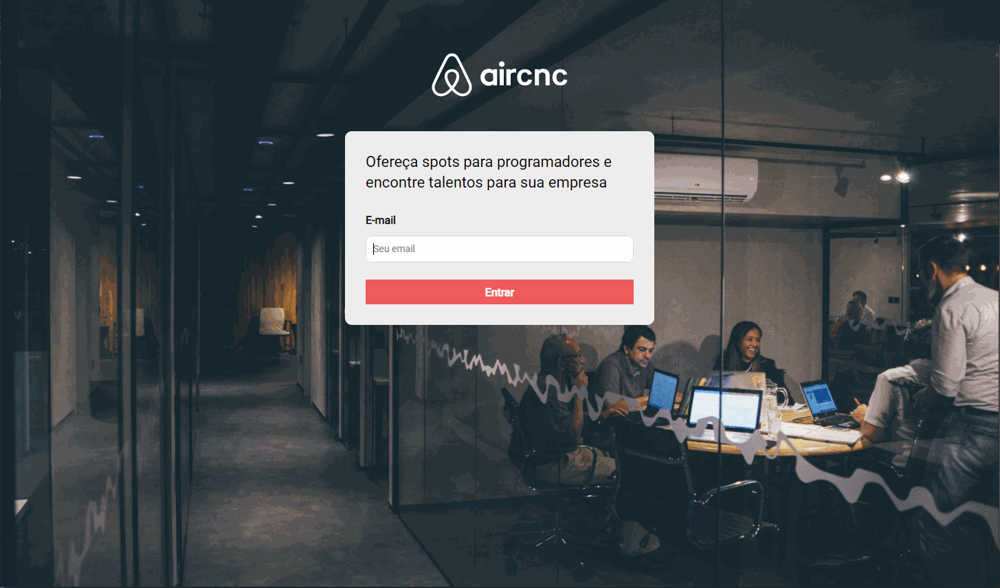

<h1 align="center">Aircnc</h1>

<h3>Semana Omnistack 08
  <h4 align="center">
    A FullStack application clone of Airbnb but turned to companies find your clients.
  </h4>
</h3>

---

<p align="center">
  

  

  

  
</p>

<h2>📔 Description</h2>

This is an application to connect companies that need to find customers to rent their spots. For the clients it is possible to filter by technology and see the places they can rent

by Rockeseat ❤️

---

`Web Aplication`

<details>
  <summary>See</summary>



</details>

`Mobile`

<details>
  <summary>See</summary>


</details>

<h2>🚀 Technologies</h2>

- [NodeJS](https://nodejs.org)
- [ReactJS](https://reactjs.org/)
- [React Native](https://facebook.github.io/react-native/)
- [Axios](https://github.com/axios/axios)
- [Styled-Components](https://styled-components.com/)
- [Express](https://expressjs.com/pt-br/)
- [MongoDB](https://www.mongodb.com/)
- [Docker](https://www.docker.com/)
- [ESLint](https://eslint.org/)
- [Prettier](https://prettier.io/)
- [Web Socket](https://socket.io/)

---

<h2>❓ How to use</h2>

`Backend`

```bash
# Clone this repository
$ git clone https://github.com/MarceloHBoff/aircnc/tree/master/backend

# Go into the repository
$ cd aircnc/backend

# Install dependencies for the backend
$ yarn

# Run the backend server
$ yarn dev
```

`Frontend`

```bash
# Clone this repository
$ git clone https://github.com/MarceloHBoff/aircnc/tree/master/frontend

# Go into the repository
$ cd aircnc/frontend

# Install dependencies for the frontend
$ yarn

# Run the frontend
$ yarn start
```

`Mobile`

```bash
# Clone this repository
$ git clone https://github.com/MarceloHBoff/aircnc/tree/master/mobile

# Go into the repository
$ cd aircnc/mobile

# Install dependencies for the mobile
$ yarn

# Start React Native Server
$ yarn start

```

Made with love by [Marcelo Boff!](https://www.linkedin.com/in/marcelo-boff)
