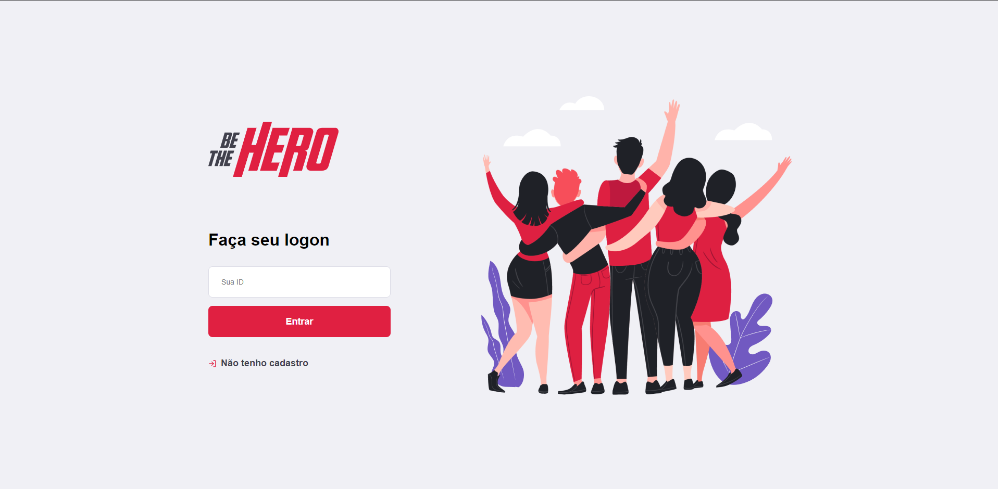
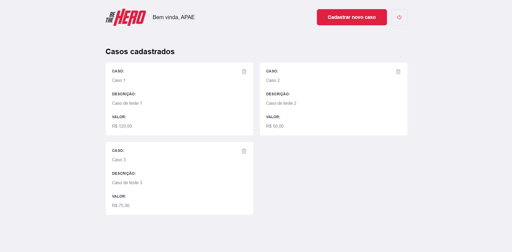
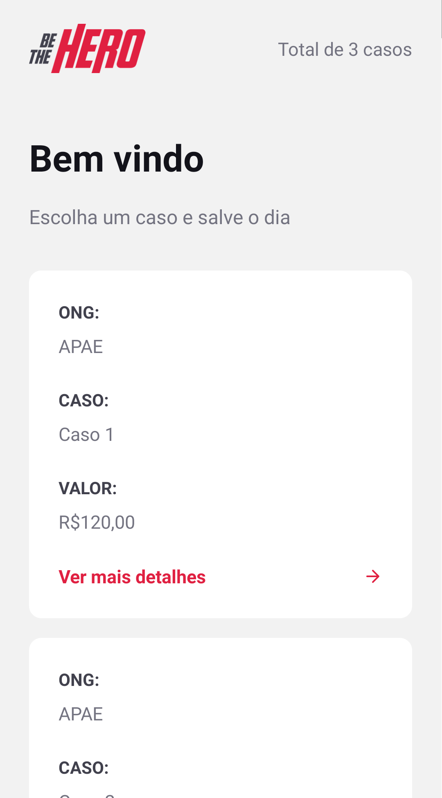
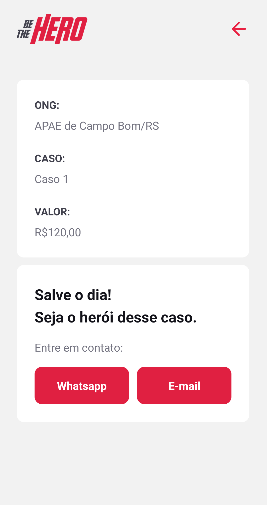

[](https://insomnia.rest/run/?label=Be%20The%20Hero&uri=https%3A%2F%2Fraw.githubusercontent.com%2FMarceloHBoff%2Fbethehero%2Fmaster%2Finsominia.json)

<h1 align="center">Be The Hero</h1>

<h3>Semana Omnistack 11
  <h4 align="center">
    A FullStack application to help non-governmental organizations to find colaborators that to help in many cases with the value to cost the several needs.
  </h4>
</h3>

---

<p align="center">
  

  

  

  
</p>

<h2>📔 Description</h2>

Were develop validators to let the routes more safe and tests in backend. In frontend application its possible make log in with a ong and register new cases. In mobile we can see all the cases and
getin touch with email or whatsapp to help the ong.

by Rocketseat ❤️

---

`Web Application`

<details>
  <summary>See</summary>




</details>

`Mobile`

<details>
  <summary>See</summary>




</details>

<h2>🚀 Technologies</h2>

- [NodeJS](https://nodejs.org)
- [ReactJS](https://reactjs.org/)
- [React Native](https://facebook.github.io/react-native/)
- [Expo](https://expo.io/)
- [Axios](https://github.com/axios/axios)
- [Styled-Components](https://styled-components.com/)
- [Express](https://expressjs.com/pt-br/)
- [ESLint](https://eslint.org/)
- [Prettier](https://prettier.io/)
- [SQLite](https://www.sqlite.org/index.html)

---

<h2>❓ How to use</h2>

`Backend`

```bash
# Clone this repository
$ git clone https://github.com/MarceloHBoff/bethehero/tree/master/backend

# Go into the repository
$ cd bethehero/backend

# Install dependencies for the backend
$ yarn

# Run the backend server
$ yarn dev
```

`Frontend`

```bash
# Clone this repository
$ git clone https://github.com/MarceloHBoff/bethehero/tree/master/frontend

# Go into the repository
$ cd bethehero/frontend

# Install dependencies for the frontend
$ yarn

# Run the frontend
$ yarn start
```

`Mobile`

```bash
# Clone this repository
$ git clone https://github.com/MarceloHBoff/bethehero/tree/master/mobile

# Go into the repository
$ cd bethehero/mobile

# Install dependencies for the mobile
$ yarn

# Start React Native Server in Android
$ yarn android

# Start React Native Server in IOS
$ yarn ios

# Open EXPO in your cellphone and scan the QRCode
```

Made with love by [Marcelo Boff!](https://www.linkedin.com/in/marcelo-boff)
