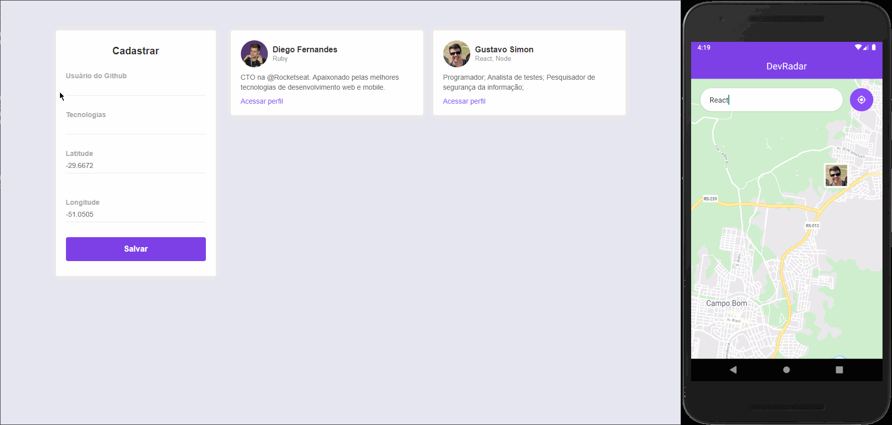

[](https://insomnia.rest/run/?label=DevRadar&uri=https%3A%2F%2Fraw.githubusercontent.com%2FMarceloHBoff%2Fdevradar%2Fmaster%2Finsomnia.json)

<h1 align="center">DevRadar</h1>

<h3>Semana Omnistack 10
  <h4 align="center">
    A FullStack application to find other developers near your location
  </h4>
</h3>

---

<p align="center">
  

  

  

  
</p>

<h2>📔 Description</h2>

This aplication is for developers to find other developers in their local area. Using the GITHUB username, you can login to the app and see the people on a map and touch the picture to show the GITHUB developer page.

by Rockeseat ❤️

---

`Application`

<h1 align="center">
    
</h1>

<h2>🚀 Technologies</h2>

- [NodeJS](https://nodejs.org)
- [ReactJS](https://reactjs.org/)
- [React Native](https://facebook.github.io/react-native/)
- [Expo](https://expo.io/)
- [Axios](https://github.com/axios/axios)
- [Styled-Components](https://styled-components.com/)
- [Express](https://expressjs.com/pt-br/)
- [MongoDB](https://www.mongodb.com/)
- [Docker](https://www.docker.com/)
- [ESLint](https://eslint.org/)
- [Prettier](https://prettier.io/)
- [Web Socket](https://socket.io/)

---

<h2>❓ How to use</h2>

`Backend`

To run this server is need a mongoDb database with name `"devradar"` running in port 27017

```bash
# Clone this repository
$ git clone https://github.com/MarceloHBoff/devradar/tree/master/backend

# Go into the repository
$ cd devradar/backend

# Install dependencies for the backend
$ yarn

# Run the backend server
$ yarn dev
```

`Frontend`

```bash
# Clone this repository
$ git clone https://github.com/MarceloHBoff/devradar/tree/master/frontend

# Go into the repository
$ cd devradar/frontend

# Install dependencies for the frontend
$ yarn

# Run the frontend
$ yarn start
```

`Mobile`

```bash
# Clone this repository
$ git clone https://github.com/MarceloHBoff/devradar/tree/master/mobile

# Go into the repository
$ cd devradar/mobile

# Install dependencies for the mobile
$ yarn

# Start React Native Server in Android
$ yarn android

# Start React Native Server in IOS
$ yarn ios

# Open EXPO in your cellphone and scan the QRCode
```

Made with love by [Marcelo Boff!](https://www.linkedin.com/in/marcelo-boff)
